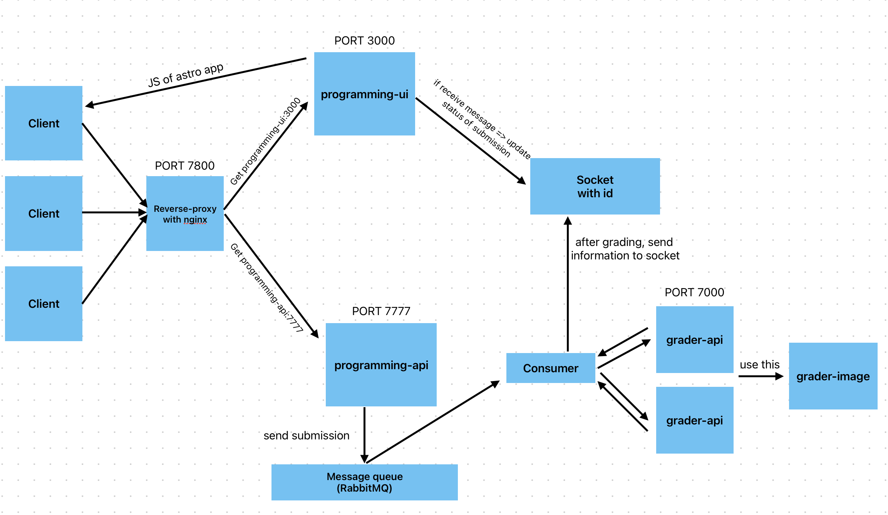
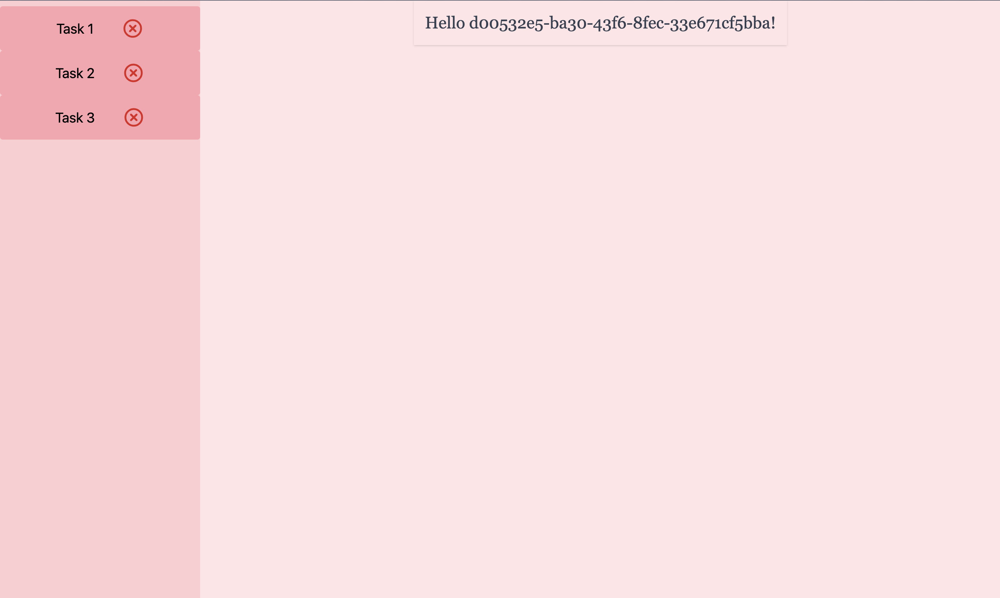

# Designing and Building Scalable Web Applications / Course Project I Template

## Contents:
This application is a web application for practicing programming. The basic functionality of the application is as follows:
When the user opens up the application, they are shown a name and a handout of a programming assignment, a textarea into which they can write a Python program that solves the problem in the handout, and a button that allows submitting the written program for assessment. After the program is sent for assessment, the user sees updates on the grading status of the program. If the grading finds issues with the program, the user is shown the issues and can adjust their code. Otherwise, the user is notified that they successfully completed the assignment, allowing them to move to the next programming assignment. The next time the user opens up the application, they can continue from the first assignment that they havent't yet completed.

## Architecture of the web application:
Below is the image of the architecture of the web application

## View of the web application:

## How to run the project:
Check out RUNNING.md

## Tech stacks:
Frontend: Svelte, Astro, TailwindCSS

Backend: Deno, PostgreSQL, RabbitMQ, WebSocket

Other tools: Nginx, Playwright, k6, Docker, Docker Compose
